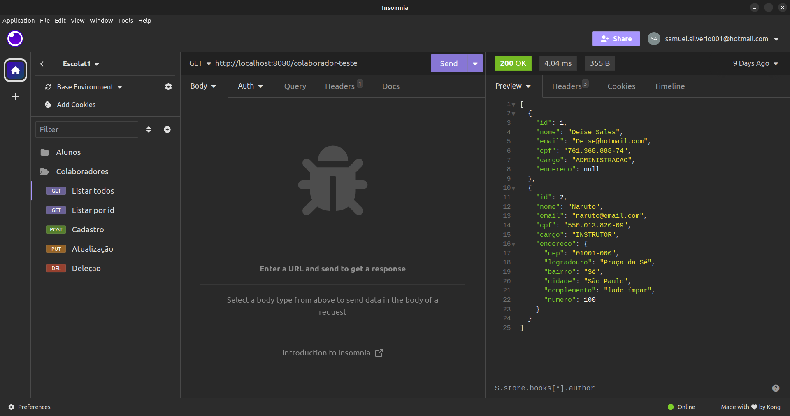
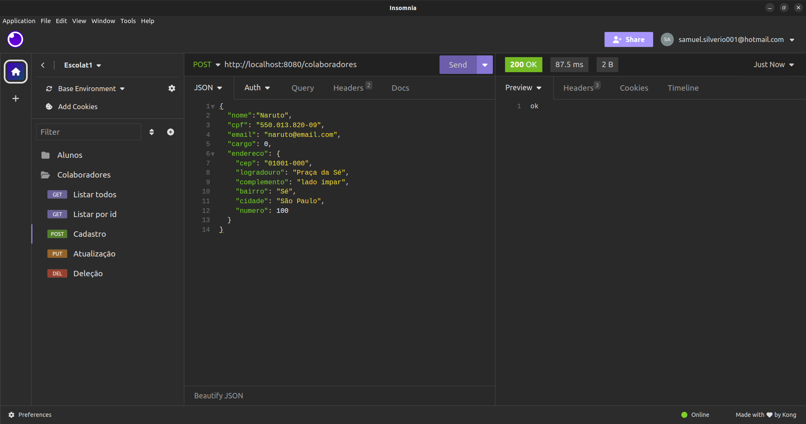
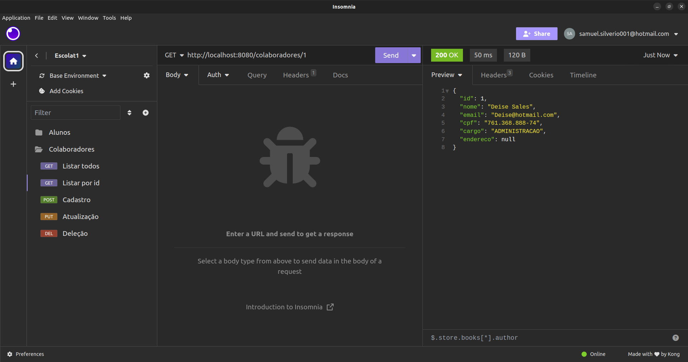
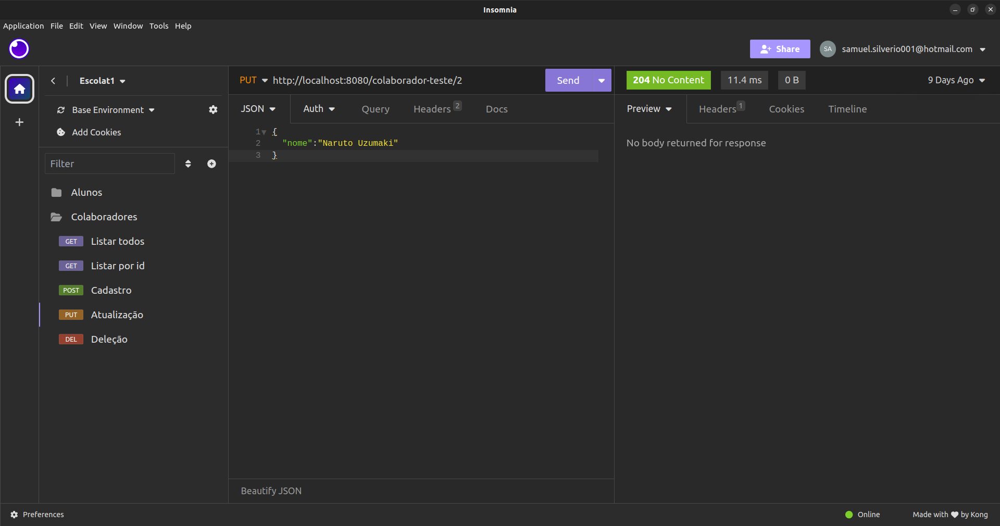
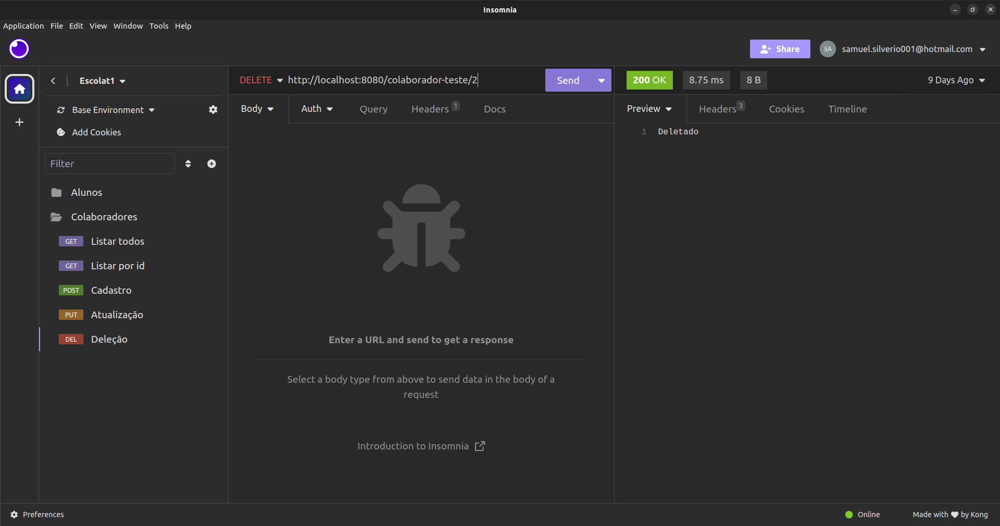

<h1 align="center">
	<br><br>
   Sistema Escolar Vai na Web
</h1>

<div>
    <a href="https://www.linkedin.com/in/samuel-silveriom/" target="_blank">
        
    </a>
    <a href="#">
		
	</a>
	<a href="#">
		
	</a>
    </p>
</div>

## Table of Contents

<p align="center">
 <a href="#Sobre">Sobre</a> •
 <a href="#features">Features</a> •
 <a href="#conceitos">Conceitos</a> • 
 <a href="#instalação">Instalação</a> • 
 <a href="#iniciando">Iniciando</a> • 
 <a href="#tecnologias">Tecnologias</a> • 
 <a href="#license">License</a>
</p>

## 📌Sobre

<div>
    <p align="center">
    <em>
   Construção de projeto em live-coding durante o curso de back end na escola vai na web
    </em>
    </p>
</div>
...

## 🚀Features

 <p align="center">
 

- Criação, Edição e Deleção de Alunos e Colaboradores.

...

## 👓Conceitos

 <p align="center">
 

- Protocolo HTTP
- Criação de Endpoints
- Organização de camadas
- Model, Controller, Repository, Enums e DTO
...
## 📕Instalação

**Você deve ter instalado**
- [Java](https://www.java.com/pt-BR/)
- [Eclipse IDE](https://www.eclipse.org/downloads/)
- [MySQL](https://dev.mysql.com/downloads/)

**Recomendações**
-   Utilize sua IDE favorita, como ItellijIdea, NetBeans ou VSCode

**Siga esses 2 passos.**
1. Clone esse repositório
2. Execute o Programa
  ---
### 1. Clone o repositório
```
git clone link do repositório 
```
--- 

### 3. Inicializando a Aplicação

1. Procure o pacote `br.com.vainaweb.escolat3` e execute a classe `Escolat3Application.java`

...

## 🎮Iniciando
1. Abra o navegador ou utilize insomnia ou postman em: `http://localhost:8080` e acesse os endpoints **(colaboradores e alunos).**

- `/colaboradores`: Para ter acesso a todos os colaboradores
  <br>

<h3 align ="center">GET</h3>
<h1 align="center">
	
</h1>

---

<h3 align ="center">POST</h3>
<h1 align="center">
	
</h1>

---

- `/colaboradores/{id}`: Para funcionalidades a partir do id
  
  <h3 align ="center">GET</h3>
<h1 align="center">
	
</h1>

---

<h3 align ="center">PUT</h3>
<h1 align="center">
	
</h1>

---

<h3 align ="center">DELETE</h3>
<h1 align="center">
	
</h1>


## 🌐Tecnologias

- [Java](https://www.java.com/pt-BR/)
- [SpringBoot](https://spring.io/)
- [MySQL](https://www.mysql.com/)

## 📝License


Feito por [Samuel Silvério](https://github.com/Samuel-prata) e os alunos da escola Vai Na Web 🚀.

